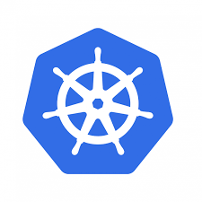

# K8 Experiments

This sample project aims to explore Kubernetes potential on microservices archiecture. In particular, project was shipped with a minimal 2-microservices architecture that put forward a simple computation.

In particular, microservice 1 (or service-1 in the rest of the document) receive a GET request from client, contact microservice 2 (or service-2 in the rest of the document) in order to acquire needed information and finally answer to the client.

With the aim to build a wide versus, a *docker-compose* version is paired to the K8 one in order to highlight the differences.

# Report
In the *report* folder you can find a full-flaged guide to Kubernetes that in turns is ispired from the Linux Foundation K8 course.

# Istructions to run DockerCompose variant

1. Build docker image
    $ cd <HOME REPO>/envs/0.docker_image

    $ ./build-img.sh

2. Setup system
    $ cd <HOME REPO>/envs/1.docker_compose_env
    
    $ docker-compose up -d

3. Log into containers and execute services
    $ docker attach CNT
    
    $ ...

4. From a browser, type

    http://localhost:9005/service_1?name="rosario"&surname="ca"&id="n"

5. You will see a JSON reponse with a particular ID

# Istructions to run Kubernetes variant 
0. Setup an NFS file system on your machine (follow the report for addictional istructions)

1. Create cluster
    $ cd <HOME REPO>/envs/3.K8_env

    $ ./0.make_cluster.sh

2. Enable Ingress
    $ ./0.turn_on_ingress.sh

3. Modify */etc/hosts* in order to assign *example.com* to minikube control plane node address
    $ minikube ip # get address of control plane node
    
    $ sudo nano /etc/hosts 

        Write: """ example.com MINIKUBE_CTRL_NODE_IP """

4. Make storage device in order to share host folders into pods

    $ ./1.make_storage.sh

4. Log into each target node and make needed docker images 
    $ minikube cp <HOME REPO>/envs/3.K8_env/DockerFile NODE_NAME:/

    $ minikube cp <HOME REPO>/envs/3.K8_env/requirements.txt NODE_NAME:/

    $ minikube cp <HOME REPO>/envs/3.K8_env/build-img.sh NODE_NAME:/

    $ minikube ssh -n NODE_NAME

    $ cd / && ./build-img.sh

5. Start system
    $ ./2.start_system.sh

6. Log into containers and execute services
    $ kubectl exec pod-name -c container-name -it -- /bin/bash
    
    $ ...

7. From a browser, type

    http://example.com/service_1?name=%22rosario%22&surname=%22ca%22&id=%22n%22

8. You will see a JSON reponse with a particular ID

